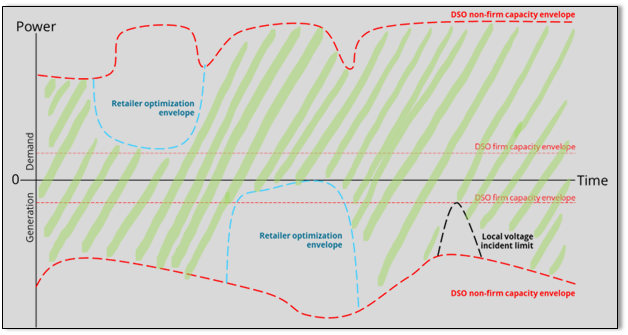
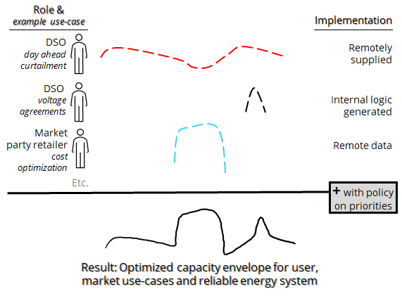
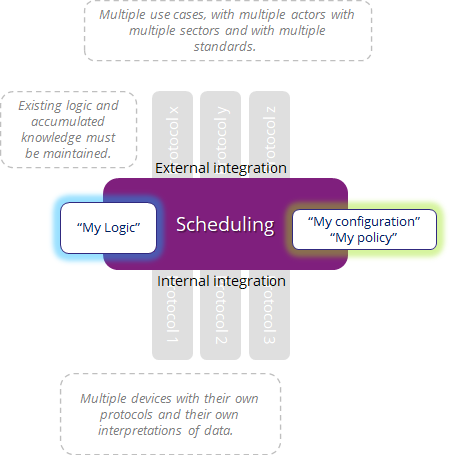

# DER-scheduling
IEC-scheduling (or DER-scheduling) is a specific form of scheduling with a lot of properties that should not be confused with any [generic scheduling](https://en.wikipedia.org/wiki/Schedule) such also as in IT.

## Introduction
This project aims to create a production grade open-source scheduling software stack, enabling consumers, manufacturers and automations suppliers to implement IEC Scheduling according to IEC 61850-7-4-2010 Annex K. Formaly known as TR IEC 61850-90-10. The main use-case is for controling Distributed Energy Resources (DER), but not limited to that. 

## Targeted applicability
- DER = Distributed Energy Resources (e.g. PV solar, Windpower, Battery infeed into distribution grid)
- EMS = (Plant / Industrial) Energy Managment Systems
- HEMS = Home Energy Management Systems
- Specific solutions such as the [FNN-steurbox](https://www.vde.com/de/fnn/arbeitsgebiete/digitalisierung-metering/lastenhefte/steuerbox) in Germany

## Why IEC scheduling?
IEC scheduling solves two structural problems in controling complex energy systems where more than one actor and more than one use-case is involved (*...and that is nearly almost the case*).

**Problem 1**: There are many controls from remote, and in the local device itself. How do I get myself into control what is happening with all those loose controls? Otherwise, I won't understand the behavior and lose control.

**Answer**: IEC scheduling completely changes the concept of controlling, compared to what is known till sofar in the IEC landscape for energy automation. The main principle of it is to place ALL controls into parallell schedules. The priority of those schedules is defined through policies. There are NO direct controls. All controls, even locally generated are placed in (separate) schedules. Included in defining this policy is to give priority to schedules dependent on situational circumstances, such as:
1. Device just starting up, so soft-start may get priorities
2. (Internet)communication is down, so slowly move towards pre-defined (safe) schedules.
3. Voltage is too high, so curtailment of infeed get priority (and parallel simulate with HEMS to use more energy locally)

**Problem 2**:  What communication protocol to use, because my use-case needs "protocol y", my DSO needs "protocol z" and for car-charging I need another one. Please don't create or force me to use another communication protocol, do you?
**Answer**: Although the standard for Scheduling is under the IEC 61850 standard, the funcion scheduling itself isn't requiering the IEC 61850 communication protocol use.  It doesn't matter as long as you can manage a schedule to the scheduling logic, whatever protocol you use. This will enable you to choose your protocol which is needed for your use-case. And yes, other requirements to realize the right security level should be applied to all protocols.

## Roadmap
### Scheduling as stand alone-service (realized!)
This has been realized till sofar. The main functionalities are to control a DERs regarding:
- absolute power output
- maximal power output
- turning them on or off

The configuration of how the software is configured is realized with the [SCL file](https://github.com/alliander-opensource/der-scheduling/blob/main/models/der_scheduler.cid) which can be managed and adopted by our needs by [CoMPAS](https://github.com/com-pas). Schedules themselves are now fed into the software with an API from the CLI.
With positive results, the solution is benchmarked against German commercial FNN-steuerboxes to have the same behaviour and to have at least the same performance.

### Scheduling integraded with official communication protol (active!)
We currently integrate the IEC scheduling as stand-service into [FLEDGE](https://www.lfedge.org/projects/fledge/) in close collaboration with [FLEDGE POWER](https://lfenergy.org/projects/fledgepower/) as they share the vision to build productive software for the edge. (Please remark that "scheduling" in Fledge is not the same as IEC-scheduling or DER-scheduling developed here). In this stage we expect to communicate with one protocol (WAN) to central systems (SCADA / Substation automation like) and with one protocol (LAN and probably MQTT or Modbus) to local devices.

### Scheduling integrated with several exchangable communication protocols (stretched goal)
In this stage we expect to have the integration as such, that it is possible to use more protocols to central systems (WAN) and more protocols to local devices (LAN) independently and parallell from each other.

### Scheduling integrated with security framework for registration, monitoring etc.
In this stage we expect to have the right features and in place so that this solution can be used on broader scale securely. A basis (partly outated) in Dutch language can be found [here](https://alliander.gitbook.io/interfacespecificatie-elektriciteit-productie-eenh/bijlage_3_gemaakte_keuzes_en_toelichting). 

## Collaboration and contributing
This is a collaboration of [Alliander](alliander.com), [Fraunhofer ISE](https://www.ise.fraunhofer.de/) and [MZ Automation](https://www.mz-automation.de) and you are welcome to contribute with your expertise on raising issues, contributing to documentation, testing, making suggestions or writing code. The final acceptance of the code is done by a Technical Steering Company with the members stated above.

The work is based upon MZ Automation's [IEC 61850 Protocol Library](https://www.mz-automation.de/communication-protocols/iec-61850-protocol-library/).

## Building

Building this code requires a C toolchain and CMake installed.

The C code is developed and tested with Ubuntu 20.04. The following instructions are assuming that you are using a similar Linux environment. Otherwise the required steps might differ.

First you have to download, build, and install the latest version of [libiec61850](https://github.com/mz-automation/libiec61850) (1.5.2).

You can skip this step when libiec61850 is already installed on your PC

        $ git clone git@github.com:mz-automation/libiec61850.git
        $ cd libiec61850
        $ mkdir build
        $ cd build
        $ cmake ..
        $ make
        $ sudo make install

Building the scheduler code

        $ mkdir build
        $ cd build
        $ cmake ..
        $ make

Running the example server

In the build folder:

        $ cd examples
        $ sudo ./scheduler_example1

The example has to be executed with root permissions in order to bind to TCP port 102.
